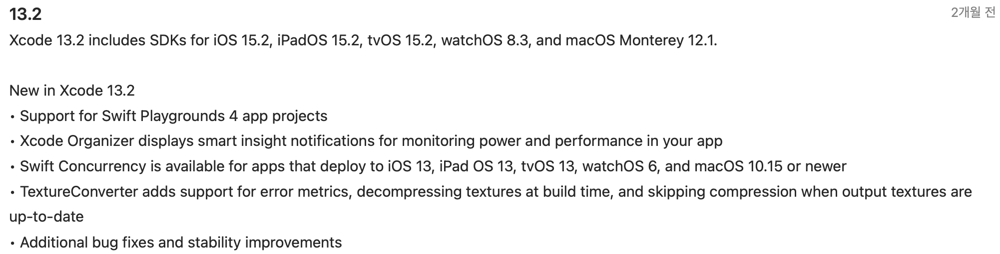

# STEP 1

## 적용기술 선정

- [RxSwift](https://github.com/ReactiveX/RxSwift)
- [CoreData](https://developer.apple.com/documentation/coredata/)

## 고민 포인트

- 하위 버전 호환성에는 문제가 없는가?
    - RxSwift 6.5.0: iOS 9.0, Xcode 12.x, Swift 5.x
    - CoreData: iOS 3.0

- 미래 지속가능성이 있는가?
    - CoreData는 애플에서 만들었으니 오래 지원될 듯 합니다.
    - RxSwift는 Combine, Swift Concurrency로 대체될 가능성이 있습니다.
        - Swift Concurrency는 macOS 12/iOS 15에서 사용 가능합니다.
        - Xcode 13.2에서는 iOS13에서도 사용 가능합니다.
        - 

- 안정적으로 운용 가능한가?

- 리스크를 최소화 할 수 있는가? 알고있는 리스크는 무엇인가?
    - RxSwift: GitHub 별도 많고, 쓰는 사람도 많아 보입니다. 1~2년 정도는 문제없이 사용가능할 것 입니다. 그러나 나중에도 이게 최선일지는 알 수 없습니다.
    - RxSwift: SPM에서 버그가 있습니다.
      
        > [RxSwift](https://github.com/ReactiveX/RxSwift#swift-package-manager)
        > **Note**: There is a critical cross-dependency bug affecting many projects including RxSwift in Swift Package Manager. We've [filed a bug (SR-12303)](https://bugs.swift.org/browse/SR-12303) in early 2020 but have no answer yet. Your mileage may vary. A partial workaround can be found [here](https://github.com/ReactiveX/RxSwift/issues/2127#issuecomment-717830502).
        >

- 어떤 의존성 관리도구를 사용하여 관리할 수 있는가?
    - CocoaPod, SPM, Carthage

- 이 앱의 요구기능에 적절한 선택인가?
    - CoreData: 로컬 데이터 저장에 적절할 것 입니다. 리모트는 문제 없을것 같지만, 아직 모릅니다.
    - RxSwift: 사용법을 잘 모르지만, 공부를 위해 사용하는 것입니다.
